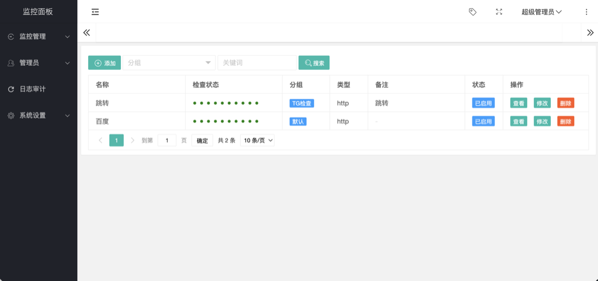

### UptimePK

时间网格图风格的监控系统

## 安装脚本
```
curl -fsSL https://raw.githubusercontent.com/midoks/tgbot/master/scripts/install.sh | bash
```

# dev
```
go env -w GOPROXY=https://goproxy.cn,direct
journalctl -u tgbot -f
```

# 0.1
```
修复一些问题。
```


### 无图不真相

[](embed/static/screenshot.png)